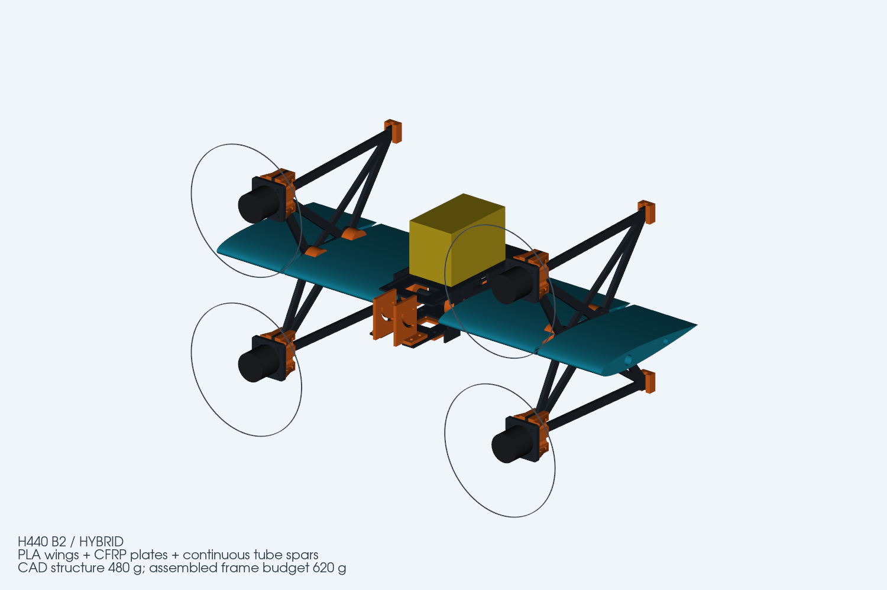
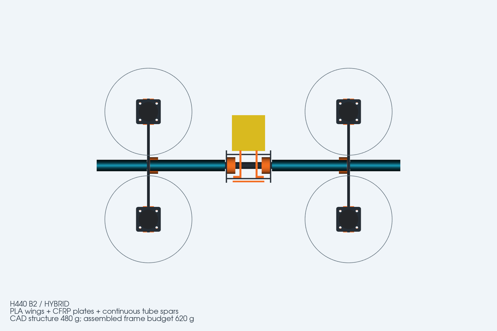

# H440 B2 — 开放电池托板与加强机臂 / Open battery tray and reinforced pylons

本版取消电池侧围板和中央 8 个打印角码，中央碳板改用一体榫舌＋闭口榫槽胶接。左右机臂升级为 4 mm 交叉加强碳板，四个电机 U座采用四孔夹紧和三角筋。B1 保留为历史制造版本；B2 不与 B1 零件混装。

This revision removes the battery cage and eight printed center-frame angles. Integral CFRP tongues fit bonded closed mortises. Both pylons use 4 mm CFRP with cross-bracing; all four motor clevises gain four-point clamping and triangular ribs. B1 remains the historical manufacturing revision. Do not mix B1 and B2 parts.

## 文件状态 / Delivery status

- 当前几何源：`../build_h440_b2.py`；27 种零件、35 个装配实体、18 个打印件 STEP、7 种碳板 DXF。
- Current geometry: 27 part definitions, 35 frame instances, 18 printable STEP files, seven CFRP DXF profiles.
- [碳板 DXF＋STEP 包 / CFRP package](H440_B2_supplier_DXF_STEP.zip)
- [打印件 STEP 包 / Printed parts](H440_B2_printed_parts_STEP.zip)
- [总装 STEP / Assembly STEP](H440_B2_FRAME.step)
- [SolidWorks 原生总装 / Native SolidWorks assembly](H440_B2_FRAME.SLDASM)
- `*.SLDPRT`：27 种 B2 原生零件；`SolidWorks_Assembly_Parts/`：总装使用的持久化实例文件。
- [SolidWorks 原生保存/重开报告 / Native save/reopen report](solidworks_native_report.json)
- [结构复核与装配要求 / Structural screening and assembly notes](结构复核与装配要求.md)
- [BOM 与重量预算](BOM与重量预算.md)
- **B2 SolidWorks 原生交付已完成验证。** 27 种原生零件均在 SolidWorks 2024 SP0.1 中静默重开通过；总装包含 35 个生成实例，重开错误为 0，所有组件引用均落在 `H440_B2/` 交付目录内。STEP 导入在本机表现为扁平化 35 零件树，脚本同时兼容带根包装总成的导入形态。
- **B2 native SolidWorks delivery is verified.** All 27 native part files reopen in SolidWorks 2024 SP0.1. The assembly contains 35 generated instances, reopens with zero load errors, and every component reference resolves inside the `H440_B2/` delivery directory. The local STEP import resolves as a flattened 35-part tree; the delivery script also supports a wrapper-subassembly import shape.

## 重量与刚度 / Mass and stiffness

机架 CAD 结构约 479.61 g，含五金、绑带、胶和金属配合垫片的机架预算约 604.01 g；建议按 620 g 预留。相对 B1 的 530.15 g 增加约 73.86 g。质量仍是体积/采购预算估算，需切片和装机称重。

CAD structure is approximately 479.61 g; assembled-frame estimate is 604.01 g, with a 620 g planning allowance. This is about 73.86 g above B1. These are estimates, not measured masses.

同一固定根部梁模型下，每电机 3 N 侧向载荷对应位移由 1.033 mm 降至 0.281 mm；0.15 N·m 反扭矩工况的转角由 0.897° 降至 0.251°。这些是理想机臂骨架的对比结果，不含打印件、胶接、管梁和螺栓连接柔度，不代表整机有限元或模态验证。

In the same fixed-root beam model, a 3 N lateral load per motor produces 1.033 mm displacement in B1 versus 0.281 mm in B2. Under the assumed 0.15 N·m motor-torque case, rotation drops from 0.897° to 0.251°. These are ideal pylon-skeleton comparisons, excluding printed fittings, adhesive, spars and joint compliance; they are not complete-aircraft FEA or modal validation.

## 首件要求 / First article

榫槽名义 2.2 × 12.2 mm，榫舌 2 × 12 mm；按实际碳板厚度和铣刀调整后先试拼，胶接防退出。电机夹槽为 4.15 mm，使用硬质金属垫片消除与实测 4 mm 碳板的间隙，禁止用软泡棉或过度拧紧 ABS 来补间隙。仍须完成胶接、静载、温升蠕变、振动和无桨控制方向检查。

Nominal mortises are 2.2 × 12.2 mm for 2 × 12 mm tongues. Adjust to measured laminate thickness and cutter capability, dry-fit, then bond for retention. The motor-clevis gap is 4.15 mm; use hard shims to fit the actual 4 mm plate. Do not use foam or excessive tightening of ABS to remove clearance. Bond, static-load, thermal-creep, vibration and propeller-off control checks remain necessary.
