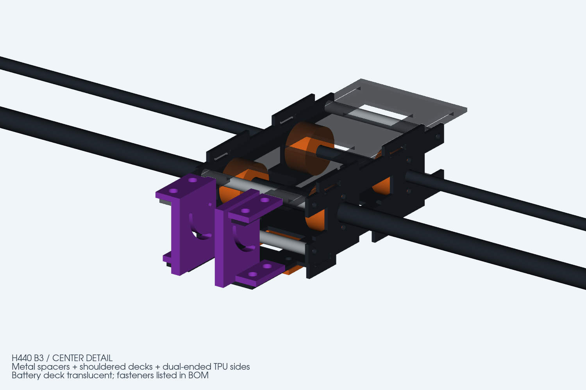
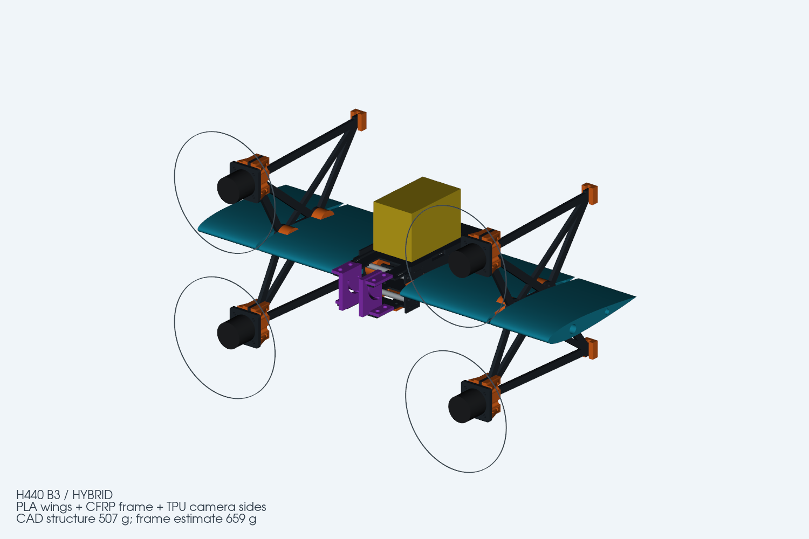
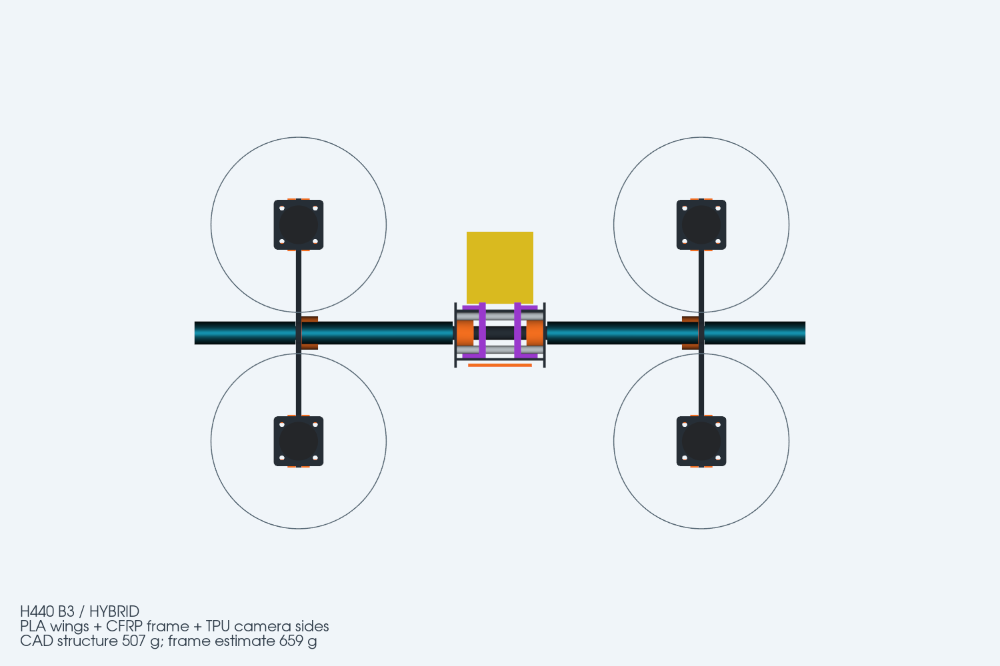

# H440 B3 — 中框机械限位与 TPU 双端摄像头支撑

本版针对 B2 中框榫舌左右防脱依赖胶接、TPU 摄像头侧板单端固定容易摆动的问题进行修改。翼展仍为 440 mm，机翼用 PLA，其余主连接件用 ABS；摄像头左右侧板用 TPU 95A。B3 中央板和相机支架须整套更换。

This revision adds positive lateral retention to the center frame and supports each TPU 95A camera side plate at both ends. The 440 mm wingspan, PLA wings and ABS structural fittings remain. Replace the center plates and camera supports as a complete B3 set.

## 中框如何限制左右滑动 / Lateral retention

飞控板四处榫根增加宽 20 mm 的止挡肩，12 mm 榫舌继续穿入侧板闭口槽。止挡肩贴合侧板内表面；电池板原有 62 mm 宽主体同样形成止挡。四根 OD6/ID3.3×62 mm 铝合金隔柱加 M3 贯穿螺栓固定两侧板间距，前后孔距 102 mm、上下孔距 24 mm。两侧板不能自由张开，托板不能越过止挡肩横移。没有角码。

Four 20 mm-wide shoulders on the electronics deck stop against the side-plate inner faces; 12 mm tongues enter the closed mortises. The 62 mm battery deck also provides shoulders. Four OD6/ID3.3×62 mm aluminium spacers and through-bolts lock the side-plate spacing, on a 102×24 mm pattern. No angle brackets are used.

榫槽仍有加工装配间隙，胶接用于消除上下、前后微动和提高抗扭刚度；不能把有游隙的干装件当成无振动结构。先干装核对四根隔柱等长、肩部贴合和托板平行，再薄层胶接，按实际板厚修整榫槽，禁止用螺栓强行拉弯碳板。

The mortises retain manufacturing clearance. Bond after dry-fitting to remove vertical/longitudinal micro-movement and improve torsional stiffness. Match spacer lengths, seat the shoulders and keep the decks parallel; do not pull warped or oversized parts into place with bolt preload.

## 摄像头支撑 / Camera support

两块 TPU 侧板由 3 mm 改为 5 mm，每块下端两颗 M3 固定在飞控板，上端两颗 M3 固定在电池板新增的前伸支耳。共八个固定点，每个 3 mm 厚固定脚配 OD5/ID3.2 限压套和大垫片。上固定脚在电池板上面，避开 M2 调角头部；电池板中央前缘开口避让相机接近朝下时的后上角。保留 M2 枢轴和弧槽连续 0–90° 调节。

Each 5 mm TPU plate uses two lower M3 screws on the electronics deck and two upper M3 screws on the extended battery-deck tabs. Eight metal crush sleeves and broad washers control compression. The upper feet sit above the battery deck, clear of the M2 adjustment screws. A center-front cutout clears the camera near its downward position. The M2 pivot and curved slot retain continuous 0–90° adjustment.

TPU 不是刚性材料，双端固定缩短自由弯曲段、减少摆动，但不能保证图像无抖动。使用 95A、侧板和固定脚高实心度打印；M2 外侧加金属垫片，按实际堆叠选螺钉长度，摄像头螺纹拧入长度不超过既定 2 mm 限值。锁角后要检查温升和时间造成的角度松动。95A 产品数据可参考 [Polymaker TPU95](https://wiki.polymaker.com/polymaker-products/more-about-our-products/documents/technical-data-sheets/tpu/polyflex-tm-tpu95)，不能直接当作实际打印件的力学证书。

TPU remains compliant. Dual support reduces unsupported bending length but does not guarantee vibration-free video. Print 95A with dense walls/feet, use metal washers on the M2 adjustments and select screw length for the actual stack and camera thread-engagement limit. Check angle retention after warming and dwell time.

## 验证与交付 / Checks and files

机架估计 659.2 g，较 B2 增加约 55.2 g；建议按 680 g 预留，尚未切片或实物称重。四根铝隔柱用标准管料定尺切断，新增成本主要为隔柱和普通螺钉。

Estimated frame mass is 659.2 g, approximately 55.2 g above B2; reserve 680 g pending slicing and weighing. Standard cut-to-length spacer stock and ordinary fasteners keep the added hardware simple.

- [BOM 与重量预算](BOM与重量预算.md)
- [中框结构复核](中框结构复核.md)
- [总装 STEP](H440_B3_FRAME.step) · [SLDASM](H440_B3_FRAME.SLDASM)
- [碳板 DXF/STEP 加工包](H440_B3_supplier_DXF_STEP.zip)
- [全部打印件 STEP 包](H440_B3_printed_parts_STEP.zip)
- [几何检查](geometry_report.json) · [机械限位与螺钉空间检查](B3_specific_checks.json)
- [原生保存与重开报告](solidworks_native_report.json)

几何检查包含全部实体干涉、±30 mm 电池配平空间、0–90° 相机本体及光轴扫掠、贯穿螺栓与头部空间、限压套和 M2 垫片空间。原生文件为导入实体，修改主尺寸应重新生成源模型；原生重开记录不代表实物强度或模态验证。

Checks cover solid intersections, battery travel, camera body/optical-axis sweep, through-bolt/head paths, crush sleeves and M2 washer clearance. Native files contain imported solids. Regenerate the source geometry for dimension changes; successful reopening is not physical strength or modal validation.

28 个原生主零件已逐个重开并核对实体数量和体积；总装 39 个组件引用全部有效，复开错误为 0。强制重建并保存后仍有 SolidWorks `NeedsRegen` 警告码 32，接收方应在其环境中重建并核对模型；这不等于整机强度已通过测试。

All 28 native masters were reopened and checked for solid count and volume. The 39-component assembly has no missing references or load errors. SolidWorks still reports `NeedsRegen` warning 32 after rebuild/save; rebuild and inspect in the recipient environment. This is not physical structural validation.

