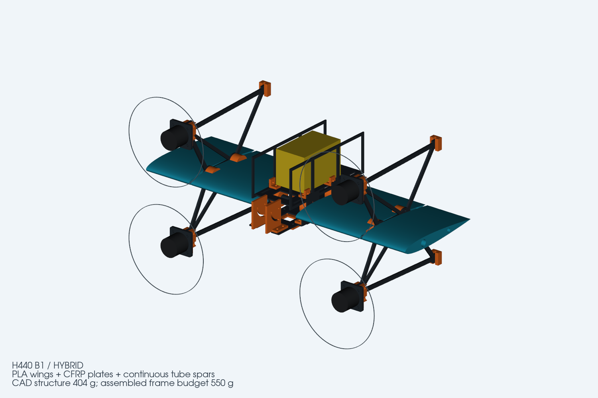
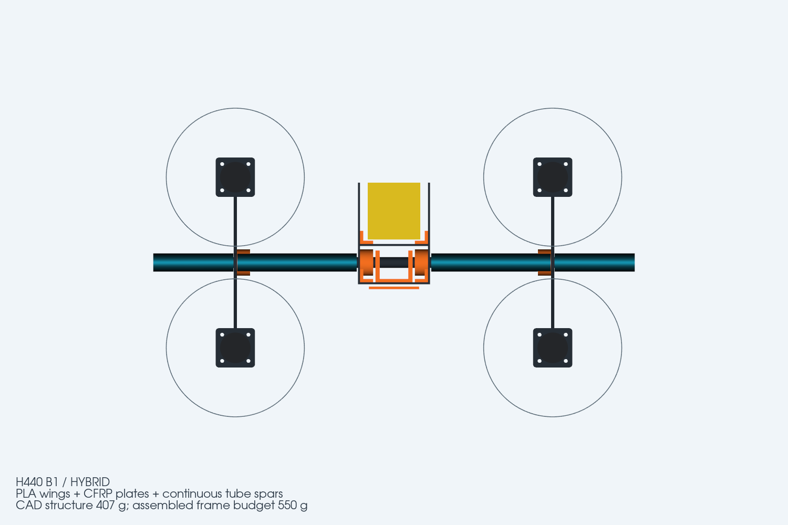

# H440 FPV H-Wing Tailsitter / H形尾座式垂起固定翼

> **B2 structural revision / B2 结构修订：** [开放电池托板、中央榫槽连接及加强机臂 / Open battery tray, bonded mortises and reinforced pylons](H440_B2/README.md). B2 STEP/DXF, comparative stiffness screening, and native SolidWorks save/reopen validation are complete. B2 的 STEP/DXF、刚度比较和 SolidWorks 原生保存/重开复核均已完成。下方 B1 内容保留为历史制造档案。

[中文说明](docs/README_zh-CN.md) · [English](docs/README_en.md) · [B1 validation / B1 复核](H440_B1/PR1复核报告.md) · [BOM](H440_B1/BOM与重量预算.md)



H440 is an engineering prototype for a compact, four-motor H-layout tailsitter VTOL airframe. The historical B1 manufacturing revision combines PLA printed wing shells, ABS fittings, 2–4 mm CFRP plates and continuous carbon-tube spars; the current B2 structural revision is documented separately above. It uses differential motor control without servos or aerodynamic control surfaces.

H440 是一款紧凑型四电机 H 形尾座式垂直起降固定翼工程样机。历史 B1 制造版本采用 PLA 打印机翼、ABS 连接件、2～4 mm 碳板和贯穿式碳管承力；当前 B2 结构修订见上方独立说明。整机构型通过四电机差速控制飞行，不使用舵机和气动舵面。

> **Prototype status / 样机状态：** CAD geometry, exports and native SolidWorks deliverables have been checked. Physical strength, propulsion, vibration, transition control and flight performance remain to be tested. / CAD 几何、导出文件和 SolidWorks 原生交付已检查；结构、动力、振动、转换控制和飞行性能仍需实物验证。

## Key specifications / 主要规格

| Item / 项目 | B1 |
| --- | --- |
| Configuration / 构型 | H-layout tailsitter VTOL / H形尾座垂起固定翼 |
| Wing / 机翼 | 440 mm span, 140 mm chord / 440 mm翼展、140 mm弦长 |
| Power / 动力 | 4 × 2306.5 1850 KV, 5-inch propellers / 四电机、5寸桨 |
| Flight stack / 飞塔 | 30.5 × 30.5 mm |
| Battery / 电池 | 6S 1600 mAh, sliding CG adjustment / 可前后移动配平 |
| Video / 图传 | Analog, DJI O4, DJI O4 Pro / 模拟、DJI O4、O4 Pro |
| O4 Pro camera / 相机 | M2 pivot + curved slots, 0–90° / M2枢轴＋弧形槽，0～90°连续可调 |
| Print bed / 打印平台 | Every printed part fits a 256 mm-class bed / 全部适配256 mm级平台 |
| Frame mass / 机架重量 | CAD 404.23 g; assembled budget 530.15 g; target reserve 550 g |



## Manufacturing downloads / 制造文件下载

| Package / 文件 | Contents / 内容 |
| --- | --- |
| [`H440_B1_supplier_DXF_STEP.zip`](H440_B1/H440_B1_supplier_DXF_STEP.zip) | 7 CFRP DXFs, matching STEP references and checksums / 7份碳板DXF、对应STEP和校验清单 |
| [`H440_B1_printed_parts_STEP.zip`](H440_B1/H440_B1_printed_parts_STEP.zip) | 19 printable STEP masters and checksums / 19个打印件STEP主模型和校验清单 |
| [`H440_B1_FRAME.SLDASM`](H440_B1/H440_B1_FRAME.SLDASM) | Native SolidWorks assembly / SolidWorks原生总装 |
| [`H440_B1_FRAME.step`](H440_B1/H440_B1_FRAME.step) | Named-part frame assembly / 带零件层级的机架总成 |
| [`H440_B1_LAYOUT.step`](H440_B1/H440_B1_LAYOUT.step) | Frame with equipment envelopes / 含设备参考包络的布局模型 |

DXF units are millimetres and contain final contours without cutter-radius compensation. Confirm kerf, sheet thickness, minimum internal radius and holding tabs with the supplier before cutting. STEP is the master format for printed parts; `_print.stl` files supply suggested orientation only.

DXF 单位为毫米，轮廓未包含刀具半径或切缝补偿。加工前应确认板厚、切缝、最小内圆角和夹持桥位。打印件以 STEP 为主模型，`_print.stl` 仅提供建议打印方向。

## Repository map / 仓库结构

```text
H440_B1/                       Active manufacturing revision / 当前制造版本
  C*.step + *_cut_mm.dxf       CFRP plate parts / 碳板零件
  P*.step + *_print.stl        Printed fittings and mounts / 打印连接件与设备座
  W*.step + *_print.stl        PLA wing sections / PLA机翼分段
  T*.step                      Carbon tubes / 碳管
  *.SLDPRT + *.SLDASM          Native SolidWorks delivery / SolidWorks原生文件
  SolidWorks_Assembly_Parts/   Persistent assembly instances / 装配实例
H440_A0/                       Archived design history / 历史版本
X120_A1/                       Small-scale experiment / 小比例实验
docs/                          Bilingual documentation / 中英文文档
build_h440_b1.py               Parametric geometry source / 参数化几何源
finish_h440_b1.py              Export and geometry checks / 导出与几何检查
```

## Rebuild / 重新生成

The editable source of truth is `build_h440_b1.py`. SolidWorks files are imported-body manufacturing deliverables rather than a hand-built parametric feature tree. / 可编辑几何以 `build_h440_b1.py` 为准；SolidWorks 文件是导入实体形式的制造交付。

```bash
python build_h440_b1.py
python finish_h440_b1.py
python package_h440_print_steps.py
python verify_delivery_archives.py
```

## Documentation / 文档

- [中文项目介绍与制造指南](docs/README_zh-CN.md)
- [English project overview and manufacturing guide](docs/README_en.md)
- [BOM 与重量预算](H440_B1/BOM与重量预算.md)
- [碳板供应商说明](H440_B1/供应商交付说明.md) · [CFRP supplier notes](H440_B1/CFRP_SUPPLIER_NOTES_EN.md)
- [打印件说明](H440_B1/打印件STEP交付说明.md) · [Printed STEP notes](H440_B1/PRINTED_STEP_NOTES_EN.md)
- [PR #1 复核报告](H440_B1/PR1复核报告.md)
- [详细设计与装配说明](H440_B1/设计与装配说明.md)

No flight-safety claim is made by this repository. Complete physical fit, load, vibration, propulsion and restrained-hover tests before flight. / 本仓库不对适飞性作出保证；飞行前必须完成装机、载荷、振动、动力和约束悬停测试。
